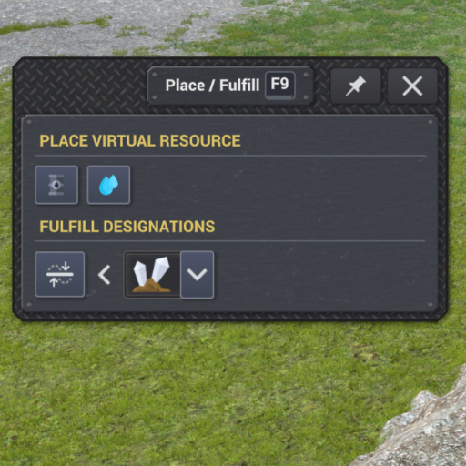

# PlaceResourceMod

A Captain of Industry mod that adds two map-design cheats usable in any game without enabling sandbox mode (which is irreversible per playthrough).



Press **F9** in-game to open a pinnable picker panel with two action sections.

## Place virtual resource

Click crude oil or groundwater in the picker, and you enter a modal placement mode:

- **Shift+Wheel** changes radius (1 to 200 tiles).
- **Ctrl+Wheel** changes quantity in 1,000 unit steps (1k to 1M).
- **Alt+Wheel** cycles between available virtual resources.
- **Plain wheel** still zooms the camera.
- **Left-click** places the deposit at the cursor.
- **Right-click** exits the placement tool.

A floating panel near the cursor shows the current resource name, quantity, and radius. A preview circle in the resource's overlay color shows the footprint.

After placing, the layers panel auto-opens and the placed resource's heatmap layer is force-enabled and refreshed, so you immediately see what landed where, even if the panel was closed or that layer had been unchecked.

The placement is surgical, only the new deposit is added; all existing deposits keep their depleted state. Save and load round-trips correctly. The mod is safe to add to or remove from a saved game, placed deposits are a base-game type and keep working even after the mod is uninstalled (the deposits stay, you just lose the placement tool).

## Fulfill designations

Use the game's normal toolbar tools (Dumping, Leveling, Mining, all available outside sandbox mode) to mark the terrain shape you want. Then in the F9 panel:

1. Click the product icon in the "Fulfill designations" row to pick a material (rocks, dirt, ore, sand), or leave empty to use the designation's default material.
2. Click the **Fulfill** button, you enter a modal area-select mode.
3. **Click+drag** a rectangle on the terrain. On release, every dumping, leveling, or mining designation whose center falls inside the rectangle is instantly fulfilled using the selected material. Terrain raises (dumping), levels (leveling), or lowers (mining) without waiting for trucks.
4. **Right-click** exits the area tool. The panel stays open.

## Install

1. Download the latest `PlaceResourceMod-x.y.z.zip` from the [Releases page](https://github.com/Nercury/coi-place-resource/releases).
2. Extract the archive into `%APPDATA%\Captain of Industry\Mods\` so the path becomes `%APPDATA%\Captain of Industry\Mods\PlaceResourceMod\manifest.json`.
3. Launch Captain of Industry.
4. Enable "Place Virtual Resource" in the mod selector when starting a new game or loading a save.
5. Press **F9** in-game.

## Build from source

Requires Captain of Industry installed (the mod references game DLLs via `$(COI_ROOT)`).

```bash
# One-time, point this at your COI install root
export COI_ROOT="C:/Steam/steamapps/common/Captain of Industry"

# Build, the resulting DLL plus manifest auto-deploy to %APPDATA%\Captain of Industry\Mods\PlaceResourceMod\
dotnet build -c Release
```

Built and tested against `net48`. The csproj sets `<Private>false</Private>` on every game/Unity reference, so `bin/Release/net48/` only contains your own DLL.

## Releasing

The repo ships a PowerShell release script. Anyone with the prerequisites listed below can cut a release end to end.

Prerequisites:
- Captain of Industry installed, `COI_ROOT` environment variable set.
- .NET SDK 8 or newer.
- PowerShell 7+ (`pwsh`).
- GitHub CLI installed (`winget install GitHub.cli`) and authenticated (`gh auth login`).
- Push access to the `main` branch on `origin`.

To cut a release:
1. Bump `version` in `manifest.json` and `<Version>` in `PlaceResourceMod.csproj`. They must match.
2. Add a `## [x.y.z] - YYYY-MM-DD` section to `CHANGELOG.md` describing the changes.
3. Commit and push to `main`.
4. From the repo root, run:
   ```powershell
   ./release.ps1
   ```

The script verifies the working tree, builds the mod, packages a zip at `bin/Release/net48/PlaceResourceMod-x.y.z.zip`, creates and pushes the `vx.y.z` tag, and creates the public GitHub release with the zip attached and the CHANGELOG section as the release notes.

Use `./release.ps1 -DryRun` to print every step without changing anything.

If a step fails, the script exits with a clear message before any tag or release is created.

## License

MIT, see [LICENSE](LICENSE).
